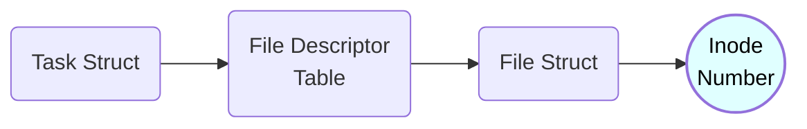
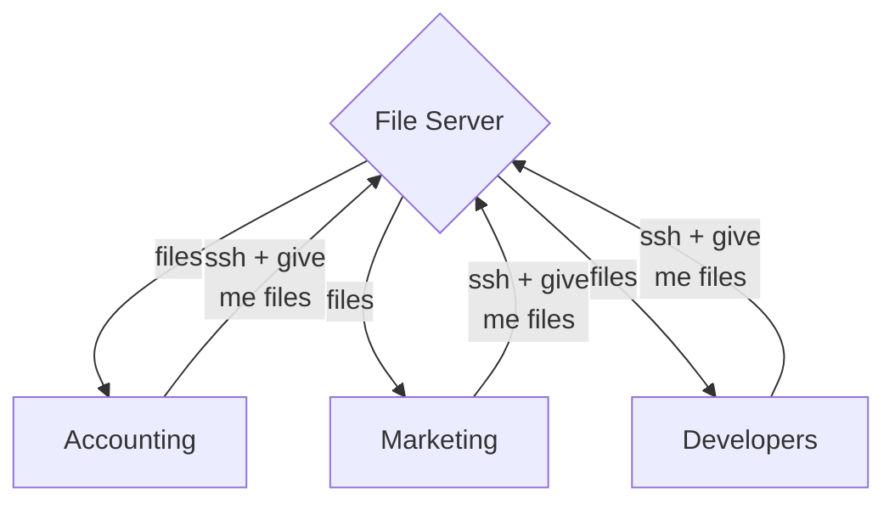
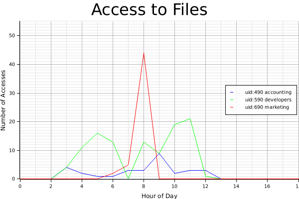
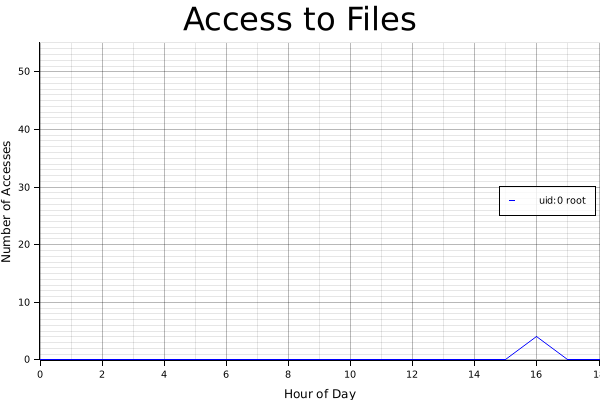

# Monitoring File Access with eBPF

## Visualizing File Reads

When reading a file on your computer, the following diagram is roughly what happens:


Obviously there are more steps than this such as first using the open system call to get a file descriptor, checking the cache for the file before checking disk, etc.

But for all practical purposes the above model will do. In writing the process is:

1) Some userspace process is executed by some user. This program asks the operating system to read a file based on its current file descriptors.
2) The operating system will execute the read() system call with the provided file descriptor e.g. read(fd).
3) The file data is returned by disk and passed all the way back up to the user.


Now how do we monitor every single time a file is read?

To do so we need to monitor every time the read() system call is executed and log this data. There are multiple approaches to doing this, I have chosen to do this using eBPF tracepoints. This was tested on Ubuntu 22.04 kernel version 5.19.


With the eBPF tracepoint in place the diagram becomes the following:


This is a bit simplified because really the tracepoint executes just before entering read() but the main point is it happens before retrieving the file from disk.


So what is the tracepoint doing? And how does this help us know when reads happen to a file? After all we know that file descriptors are only meaningful to the process they belong to. 


While that is true we need to remember how file descriptors get converted to files.


## Important Kernel Structures

The main kernel structures of importance are the following:

1) Task Struct
2) Files Decriptor Table
3) File Struct

Recall that on disk, every file has an unique inode. And unless some very specific scenarios happen this inode will be permanent to the file. Omitting just a few steps along the way, getting an inode looks roughly like the following:




Basically every process has a *task structure*. This task strcuture has access to the *file descriptor table* for that process. This table is **what gives file descriptors meaning** to the process. Every file descriptor is an index into this table that returns a specific *file struct* pertaining to a file opened by the process. The file struct ultimately holds the *inode* for the file.


Now what does this all have to do with our eBPF tracepoint?


## Bringing it all together

Recall that the read() system call, **as well as** the eBPF program execute in kernel space. One of the helper functions available to the eBPF program is [bpf_get_current_task()](https://github.com/iovisor/bcc/blob/master/docs/reference_guide.md#7-bpf_get_current_task). This function returns the task structure for the given process. 

Accessing kernel data structures fields with eBPF isn't as straightforward as acessing a strucutre in userspace. You need to call a few other helper functions. The code of my tracepoint function in the file **read_mon.bpf.c** can be seen below:

```c
SEC("tp/syscalls/sys_enter_read")
int tp_sys_enter_read(struct my_syscalls_enter_read *ctx) {
    
    //struct to hold logged data
    struct read_data_t data = {}; 

    //log the pid, uid, fd, and the command
    data.pid = bpf_get_current_pid_tgid() >> 32;
    data.uid = bpf_get_current_uid_gid() & 0xFFFFFFFF;
    data.fd = ctx -> fd;
    bpf_get_current_comm(&data.command, sizeof(data.command));


    //get the task struct for the process that enetered read
    struct task_struct *task = (void *)bpf_get_current_task();

    //this is the files array, the fd is the index into this
    //and let's you get the file struct for the fd
    struct file **fd = BPF_CORE_READ(task, files, fdt, fd);

    //file struct for fd
    struct file* file;
    //inode struct for fd
    struct inode* inode;
    //inode number for fd
    u64 ino;


    //print the fd and inode 
    bpf_probe_read(&file, sizeof(file), &fd[data.fd]);
    bpf_probe_read(&inode, sizeof(inode), &file->f_inode);
    bpf_probe_read(&ino, sizeof(ino), &inode->i_ino);
    bpf_printk("fd ++++++= %d", ctx->fd);
    bpf_printk("inode +++++= %lu ", ino);


    //log the inode
    data.inode = ino;
        

    //send data to buffer to be polled by userspace
    bpf_ringbuf_output(&output_read, &data, sizeof(data), 0);   

    return 0;
}
```

The first line uses a special macro to define where we want the system call to happen. In this case when entering the read() system call. The ctx argument is of type *"struct my_syscalls_enter_read"* which is a custom defined struct based on the arguments to the read system call. The only thing we actually need from this is the file descriptor so we can see which file the process is accessing. For more information on how this struct was defined see chapter 7 of [Liz Rice's book](https://isovalent.com/learning-ebpf/) on eBPF under the section "Tracepoints".

The read_data_t is another custom defined struct. See read_mon.h for more info. Its design is completely arbitrary and is used to log the important information from the tracepoint execution, because eventually this information will make it's way back to userspace so we can actually analyze it.


We log some data to the read_data_t struct like pid, uid, etc. But what we care about most is getting the inode of the file being read. The real meat of the code that does this is:

```c
    //get the task struct for the process that enetered read
    struct task_struct *task = (void *)bpf_get_current_task();

    //this is the files array, the fd is the index into this
    //and let's you get the file struct for the fd
    struct file **fdtable = BPF_CORE_READ(task, files, fdt, fd);

    //file struct for fd
    struct file* file;
    //inode struct for fd
    struct inode* inode;
    //inode number for fd
    u64 ino;


    //print the fd and inode 
    bpf_probe_read(&file, sizeof(file), &fdtable[data.fd]);
    bpf_probe_read(&inode, sizeof(inode), &file->f_inode);
    bpf_probe_read(&ino, sizeof(ino), &inode->i_ino);
```

Here we get the task struct appropriately named "task" above. We then trace this to the file descriptor table named "fdtable". You can see that this is of type struct file\*\*. In other words an array of struct file\* . Using the file descriptor that was passed to read(), stored in "data.fd" we index into the file descriptor table which reads the file struct into "file". We then access the inode field of the file struct and voila! We have the inode of the file being read! 

I was super excited when I realized this works. These eBPF programs are all kernel safe and super lightweight so being able to get this far was really exciting.

Note that the bpf_probe_read functions are the special "helper" functions required to read kernel structures in an eBPF program. For more info see [here](https://man7.org/linux/man-pages/man7/bpf-helpers.7.html).


Now what about this line at the end?

```c
    //send data to buffer to be polled by userspace
    bpf_ringbuf_output(&output_read, &data, sizeof(data), 0); 
```

Well as the comment suggests, this sends data to a buffer which can later be polled by a userspace program. More accurately this buffer is what's called an eBPF map. You can think of an eBPF map as a structure that helps share data between kernel space and user space. The specific map in this case is called "output_read" and is defined as follows:

```c
struct {
    __uint(type, BPF_MAP_TYPE_RINGBUF);
	__uint(max_entries, 1024 * 1024 /* 256 KB */);
} output_read SEC(".maps");
```

The type of the map is *BPF_MAP_TYPE_RINGBUF* which is why I referred to it as a buffer. For a full list of map types see [here](https://prototype-kernel.readthedocs.io/en/latest/bpf/ebpf_maps.html). Note that the eBPF documentation isn't 100% organized. This is because its development constantly evolves with the Linux kernel. For instance the article on maps I share doesn't even mention the ringbuf type. Ringbuf types are relatively new at the time of this writing. A great article on them and why they were created can be found [here](https://nakryiko.com/posts/bpf-ringbuf/) (in general Andrii Nakryiko has super helpful stuff).


Ok but back to the project!

## Getting Data in Userspace


After diving into the guts of the kernel it's time to reap the rewards by writing some much easier userspace code! This code isn't very exciting but is very rewarding. What it will do is poll the buffer (our eBPF map) to check when there's fresh data from the kernel side eBPF program. It does this on a loop, and then acts on that data. 

This is done in read_mon.c. First the ringbuffer connection is initialized and then polled repeatedly:

```c
//initialize ring buffer connection
	rb_read = ring_buffer__new(bpf_map__fd(skel->maps.output_read), handle_event_read, NULL, NULL);
	if (!rb_read) {
		err = -1;
		fprintf(stderr, "Failed to create ring buffer\n");
		read_mon_bpf__destroy(skel);
        return 1;
	}

	//poll the ring buffer repeatedly
	while (true) {
		err = ring_buffer__poll(rb_read, 100 /* timeout, ms */);
		// Ctrl-C gives -EINTR
		if (err == -EINTR) {
			err = 0;
			break;
		}
		
	}
```


In the call to ring_buffer__new the argument "handle_event_read" is a callback function that gets called whenever we poll the buffer and it has data to give us. It is the most interesting part of this file and it is seen below:

```c
int handle_event_read(void *ctx, void *data, size_t data_sz)
{
	//convert data from buffer to struct
	struct read_data_t *kern_dat = data;

	//only log for specific list of files to monitor
	if(kern_dat-> inode != 1396301 && kern_dat -> inode != 1318781){
		return 0;
	}

	FILE* outfile;
  
    // open log file for appending
    outfile = fopen("/home/logan/read_access.log", "a+");
    if (outfile == NULL) {
        fprintf(stderr, "\nError opened file\n");
        exit(1);
    }

	uint64_t nanoseconds;
    struct timespec ts;
    int return_code = timespec_get(&ts, TIME_UTC);
    if (return_code == 0)
    {
        printf("Failed to obtain timestamp.\n");
        nanoseconds = UINT64_MAX; // use this to indicate error
    }
    else
    {
        //get the timestamp in nano seconds
        nanoseconds = SEC_TO_NS((uint64_t)ts.tv_sec) + (uint64_t)ts.tv_nsec;
    }
	
	//append data to file in json format
	int chars_written = fprintf(outfile, "{\"timestamp\":%llu,\"pid\":%d,\"uid\":%d,\"fd\":%d,\"inode\":%lu,\"command\":\"%s\"}\n", nanoseconds, kern_dat->pid, kern_dat -> uid, kern_dat -> fd, kern_dat -> inode, kern_dat -> command);
  

	if(chars_written < 0){
		printf("Error writing to file, err = %d", chars_written);
	}else{
		printf("Wrote %d chars to file", chars_written);
	}

    // close file
    fclose(outfile);

	return 0;
	
}

```

Right away notice we are using the same "read_data_t" struct. As I mentioned earlier we are passing data from kernel space to user space. So it makes sense the same struct would be used on the sending and receiving ends. 

Once the buffer data is casted to the struct we have access to the inode that was registered from the read call. We check if it is one of the inodes to monitor. For now these are just hard coded. In a future update this will be read from a file.

Note to get the inode for a file you can run "ls -i | grep {filename}" in a directory, for example this is the output I get when checking for a file called "superdupersecret.txt":

```console
logan@logan-ThinkPad-X1-Extreme-2nd:~$ ls -i | grep "superdupersecret.txt"
1396301 superdupersecret.txt
```

And you can see in the code this is one of the inode numbers I am checking for.

Assuming the read() system call was called on an inode of interest, we open our log file for appending, get a timestamp in nanoseconds, and then write the data to the log file in json format.


Easy as that :)

I have an additional folder in this repo called "graphing", which takes the log file and outputs some nice graphs for us to analyze the data in a more readable format. I am not going to cover this code since it's mainly just data parsing. However if you are into Rust (I'm a pretty big fan so far) I recommend checking out two of the crates (Rust's version of libraries/packages) used in that code. The first is [serde](https://crates.io/crates/serde) which is used to serialize/deserialize json (e.g. how we read the log file into a Rust struct). And the second which I just recently discovered is [plotters](https://crates.io/crates/plotters). This crate is super cool! If you are coming from matplotlib it's not that hard to get started with plotters and I highly recommend.


## Visualizing the Data and Sample Use Case

Now what good would this tool be if I couldn't list at least one case where it might be helpful. Let's consider the following setup. We have a small company with 3 departments: accounting, marketing, and developers. Since they are just a startup company money is tight and so all of their files are managed on a central computer in the office. They ssh into this machine when they need to access files. The setup looks as follows:



Now luckily their file server is running Ubuntu 22.04 kernel version 5.19 ;) So they go ahead and add my code for monitoring file reads since it's been well tested in this environment.

The accounting department and developers both deal with sensitive data. Accounting deals with financial data and updating credits cards. The developers deal with password hashes, and user access tokens. The company wanted to minimize the number of files with sensitive data so both accounting and the developers store/read their data with a file called "superdupersecret.txt".

Marketing has been well instructed not to view this file. And given that they are trustworthy there has beeen no cause for concern. But just for extra measure they add the inode of "superdupersecret.txt" to the monitoring software and check the log files daily.

They wake up one morning and see the following:

(Generated from actual file reads, see the \*_read.py files I have under the "pseduo_read" folder)



You can see the the accounting department and the developers are accessing the files like they normally would. But also... The marketing department has an extremely high peak around 8AM. This would be a massive red flag for an intrusion detection system that understands the companies policies. In a real world situation you would want an intrustion detection system that completely blocks the ip address of marketing computers from being able to access the file server at all as they have likely been compromised.

While this example is obviously generated it is not far off from what you might imagine happening in the real world. For example if you were to put the monitor to instead watch for reads to /etc/passwd and then you notice the user "apache" is making 1000s of reads at 4AM you would likely want to shutdown the system...


## Running the Code 

If you want to run the code and play around with monitoring the reads to a file the easiest way is to use the Dockerfile in this respository.

What you can do is clone the repo:

```console
git clone https://github.com/laikas123/FileAccessMonitor.git
```

Next cd into the repo and build the docker image:

```console
cd FileAccessMonitor/
docker build --no-cache -t "ebpfbox:Dockerfile" .
```

This will take a few minutes to run, but after it finishes you can get a root shell into the container by running this command:

```console
docker run -ti --privileged ebpfbox:Dockerfile /bin/bash
```

Once inside the root shell we need to mount the kernel debug file system to that we can use tracepoints:

```console
mount -t debugfs none /sys/kernel/debug
```

Ok one last setup thing then we can get to some fun stuff.

Since the program works on inodes we need to get an inode for a file we want to monitor.

You do something like the following:

```console
root@6d306eb17519:/# echo "secret data here" > mysecretfile.txt
root@6d306eb17519:/# ls -i | grep "mysecretfile.txt"
947280 mysecretfile.txt
```
Note your inode number might be different. 

Next in read_mon.c update the following line to contain your inode:

```c
        //only log for specific list of files to monitor
        if(kern_dat-> inode != 947280){
                return 0;
        }
```

Where you would replace 947280 with your inode number.

Great! So now we can run our tracepoint program. To do so change into the repo, run make, then run the executable:

```console
cd FileAccessMonitor
make
./read_mon
```

We will leave this running. Next open a new terminal on your computer and enter the following command:

```console
docker ps
```

You should see some ouptut similar to the following:

```console
docker ps
CONTAINER ID   IMAGE                   COMMAND                  CREATED          STATUS          PORTS                                       NAMES
6d306eb17519   ebpfbox:Dockerfile                                              eager_buck
```

The formatting is a bit messy in the README file, but basically in the row where IMAGE column says "ebpfbox:Dockerfile" you'll want to grab the data from the CONTAINER ID column. In my case the container id is 6d306eb17519. With this id in hand run the following to get a root shell into the same container running in the other terminal:

```console
logan@logan-ThinkPad-X1-Extreme-2nd:~$ docker exec -ti --privileged 6d306eb17519 /bin/bash
root@6d306eb17519:/#
```

Great, now let's read from the file "mysecretfile.txt".

```console
root@6d306eb17519:/# cat mysecretfile.txt 
secret data here
```

The program will have created an access log that we can view by running:

```console
root@6d306eb17519:/# cat read_access.log 
{"timestamp":1684428373602394137,"pid":81664,"uid":0,"fd":3,"inode":947280,"command":"cat"}
{"timestamp":1684428373602484617,"pid":81664,"uid":0,"fd":3,"inode":947280,"command":"cat"}
```

We officially logged data from the read() system call!

Noe there are two lines of output because cat uses the read system call twice.

This can be verified by installing and running strace:

```console
apt get install strace
strace -q cat mysecretfile.txt
...
read(3, "secret data here\n", 131072)
read(3, "", 131072)
...

Note that 3 is the file descriptor used by cat to read "mysecretfile.txt" which we can verify by reading the now 4 lines from the access log:

```console
root@6d306eb17519:/# cat read_access.log 
{"timestamp":1684428373602394137,"pid":81664,"uid":0,"fd":3,"inode":947280,"command":"cat"}
{"timestamp":1684428373602484617,"pid":81664,"uid":0,"fd":3,"inode":947280,"command":"cat"}
{"timestamp":1684428553094139244,"pid":82415,"uid":0,"fd":3,"inode":947280,"command":"cat"}
{"timestamp":1684428553094667248,"pid":82415,"uid":0,"fd":3,"inode":947280,"command":"cat"}
```

Note that fd is 3 for every entry. And we called cat twice so a total of 4 entries.


Ok great so it's all working.

To get the graph we will need to install cargo to run the rust program.

To do so simply run this line (from the [Rust site](https://www.rust-lang.org/tools/install)) and press enter when prompted

```console
curl --proto '=https' --tlsv1.2 -sSf https://sh.rustup.rs | sh
```

Then run the following to configure the current shell:

```console
source "$HOME/.cargo/env"
```

There is one more additional thing to install so that the plotters crate works. As mentioned on their [getting started page](https://plotters-rs.github.io/book/intro/getting_started.html) we need to run:

```console
apt-get install libfontconfig libfontconfig1-dev
```

Ok lastly all we need to do is cd into the Rust project and run it:

```console
cd FileAccessMonitor/graphing/
cargo run
```

Cargo will install some dependencies. And after a few minutes it should complete without issues. 

Note, there is no output because it's simply creating a .png file for the graph.

To move this to your local machine run:

(again use your container id instead of mine)

```console
docker cp 6d306eb17519:/read_mon.png ~/read_mon.png
```

If you followed this tutorial line for line you should see something similar to the following when viewing the image:

(The hours will probably be different)




Awesome! You are officially up and running. If you want to run on a desktop instead you can pretty much just take the commands from the docker file and run them on your own computer.

If you want to simulate some reads to a file with some slight randomness check out the pseudo_read folder. It's pretty basic, but easy to use. Note you will need to update the UIDs in the Rust file based on the users you use.


## Wrapping Up: Some Final Thoughts


Some final things I would like to mention about this project and eBPF in general. 

If all of the code doesn't make sense that is totally ok. I couldn't have created this project without the help of others. For instance, the make file is purely from Liz Rice's repo in the [chapter7 folder](https://github.com/lizrice/learning-ebpf/blob/main/chapter7/Makefile) with only some slight modificaitons. Additionally you will notice in the file hello.c, there are references to a "read_mon.skel.h" file. But you will notice my repo doesn't have this file...

This is generated when you run the Makefile. And the code in hello.c that utilizes this skel header file is boiler plate code. The topic is beyond the scope of this read me, but again [Liz Rice's book] is excellent and makes stuff super clear as well as providing a ton of references for further reading.


All in all I just wanted to say if things with eBPF seem confusing at frist that is more than normal. It's a bit difficult to grasp at first, and it doesn't help that it's evolving constantly. 

On the flip side however it is exciting because it's such a powerful tool, and even though it's constantly evolving the more you play around with it the easier it is. And it's awesome when you can build your own tracing tools!

I hope this was helpful and happy coding :) 


