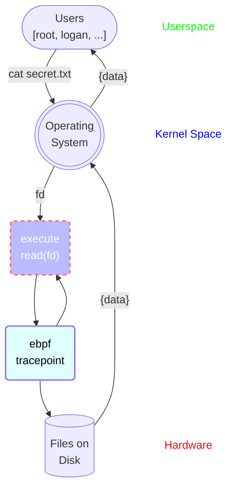
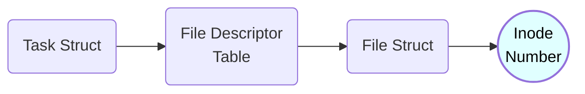

# Monitoring File Access with eBPF

## Visualizing File Reads

When reading a file on your computer, the following diagram is roughly what happens:


Obviously there are more steps than this such as first using the open system call to get a file descriptor, checking the cache for the file before checking disk, etc.

But for all practical purposes the above model will do. In writing the process is:

1) Some userspace process is executed by some user. This program asks the operating system to read a file based on its current file descriptors.
2) The operating system will execute the read() system call with the provided file descriptor e.g. read(fd).
3) The file data is returned by disk and passed all the way back up to the user.


Now how do we monitor every single time a file is read?

To do so we need to monitor every time the read() system call is executed and log this data. There are multiple approaches to doing this, I have chosen to do this using eBPF tracepoints. This was tested on Ubuntu 22.04 kernel version 5.19.


With the eBPF tracepoint in place the diagram becomes the following:



This is a bit simplified because really the tracepoint executes just before entering read() but the main point is it happens before retrieving the file from disk.


So what is the tracepoint doing? And how does this help us know when reads happen to a file? After all we know that file descriptors are only meaningful to the process they belong to. 


While that is true we need to remember how file descriptors get converted to files.


## Important Kernel Structures

The main kernel structures of importance are the following:

1) Task Struct
2) Files Decriptor Table
3) File Struct

Recall that on disk, every file has an unique inode. And unless some very specific scenarios happen this inode will be permanent to the file. Omitting just a few steps along the way, getting an inode looks roughly like the following:




Basically every process has a *task structure*. This task strcuture has access to the *file descriptor table* for that process. This table is **what gives file descriptors meaning** to the process. Every file descriptor is an index into this table that returns a specific *file struct* pertaining to a file opened by the process. The file struct ultimately holds the *inode* for the file.


Now what does this all have to do with our eBPF tracepoint?


## Bringing it all together

Recall that the read() system call, **as well as** the eBPF program execute in kernel space. One of the helper functions available to the eBPF program is [bpf_get_current_task()](https://github.com/iovisor/bcc/blob/master/docs/reference_guide.md#7-bpf_get_current_task). This function returns the task structure for the given process. 

Accessing kernel data structures fields with eBPF isn't as straightforward as acessing a strucutre in userspace. You need to call a few other helper functions. The code of my tracepoint function in the file **read_mon.bpf.c** can be seen below:

```c
SEC("tp/syscalls/sys_enter_read")
int tp_sys_enter_read(struct my_syscalls_enter_read *ctx) {
    
    //struct to hold logged data
    struct read_data_t data = {}; 

    //log the pid, uid, fd, and the command
    data.pid = bpf_get_current_pid_tgid() >> 32;
    data.uid = bpf_get_current_uid_gid() & 0xFFFFFFFF;
    data.fd = ctx -> fd;
    bpf_get_current_comm(&data.command, sizeof(data.command));


    //get the task struct for the process that enetered read
    struct task_struct *task = (void *)bpf_get_current_task();

    //this is the files array, the fd is the index into this
    //and let's you get the file struct for the fd
    struct file **fd = BPF_CORE_READ(task, files, fdt, fd);

    //file struct for fd
    struct file* file;
    //inode struct for fd
    struct inode* inode;
    //inode number for fd
    u64 ino;


    //print the fd and inode 
    bpf_probe_read(&file, sizeof(file), &fd[data.fd]);
    bpf_probe_read(&inode, sizeof(inode), &file->f_inode);
    bpf_probe_read(&ino, sizeof(ino), &inode->i_ino);
    bpf_printk("fd ++++++= %d", ctx->fd);
    bpf_printk("inode +++++= %lu ", ino);


    //log the inode
    data.inode = ino;
        

    //send data to buffer to be polled by userspace
    bpf_ringbuf_output(&output_read, &data, sizeof(data), 0);   

    return 0;
}
```

The first line uses a special macro to define where we want the system call to happen. In this case when entering the read() system call. The ctx argument is of type *"struct my_syscalls_enter_read"* which is a custom defined struct based on the arguments to the read system call. The only thing we actually need from this is the file descriptor so we can see which file the process is accessing. For more information on how this struct was defined see chapter 7 of [Liz Rice's book](https://isovalent.com/learning-ebpf/) on eBPF under the section "Tracepoints".

The read_data_t is another custom defined struct. See read_mon.h for more info. Its design is completely arbitrary and is used to log the important information from the tracepoint execution, because eventually this information will make it's way back to userspace so we can actually analyze it.


We log some data to the read_data_t struct like pid, uid, etc. But what we care about most is getting the inode of the file being read. The real meat of the code that does this is:

```c
    //get the task struct for the process that enetered read
    struct task_struct *task = (void *)bpf_get_current_task();

    //this is the files array, the fd is the index into this
    //and let's you get the file struct for the fd
    struct file **fdtable = BPF_CORE_READ(task, files, fdt, fd);

    //file struct for fd
    struct file* file;
    //inode struct for fd
    struct inode* inode;
    //inode number for fd
    u64 ino;


    //print the fd and inode 
    bpf_probe_read(&file, sizeof(file), &fdtable[data.fd]);
    bpf_probe_read(&inode, sizeof(inode), &file->f_inode);
    bpf_probe_read(&ino, sizeof(ino), &inode->i_ino);
```

Here we get the task struct appropriately named "task" above. We then trace this to the file descriptor table named "fdtable". You can see that this is of type struct file\*\*. In other words an array of struct file\* . Using the file descriptor that was passed to read(), stored in "data.fd" we index into the file descriptor table which reads the file struct into "file". We then access the inode field of the file struct and voila! We have the inode of the file being read! 

I was super excited when I realized this works. These eBPF programs are all kernel safe and super lightweight so being able to get this far was really exciting.

Note that the bpf_probe_read functions are the special "helper" functions required to read kernel structures in an eBPF program. For more info see [here](https://man7.org/linux/man-pages/man7/bpf-helpers.7.html).


Now what about this line at the end?

```c
    //send data to buffer to be polled by userspace
    bpf_ringbuf_output(&output_read, &data, sizeof(data), 0); 
```

Well as the comment suggests, this sends data to a buffer which can later be polled by a userspace program. More accurately this buffer is what's called an eBPF map. You can think of an eBPF map as a structure that helps share data between kernel space and user space. The specific map in this case is called "output_read" and is defined as follows:

```c
struct {
    __uint(type, BPF_MAP_TYPE_RINGBUF);
	__uint(max_entries, 1024 * 1024 /* 256 KB */);
} output_read SEC(".maps");
```

The type of the map is *BPF_MAP_TYPE_RINGBUF* which is why I referred to it as a buffer. For a full list of map types see [here](https://prototype-kernel.readthedocs.io/en/latest/bpf/ebpf_maps.html). Note that the eBPF documentation isn't 100% organized. This is because its development constantly evolves with the Linux kernel. For instance the article on maps I share doesn't even mention the ringbuf type. Ringbuf types are relatively new at the time of this writing. A great article on them and why they were created can be found [here](https://nakryiko.com/posts/bpf-ringbuf/) (in general Andrii Nakryiko has super helpful stuff).


Ok but back to the project!

## Getting Data in Userspace


After diving into the guts of the kernel it's time to reap the rewards by writing some much easier userspace code! This code isn't very exciting but is very rewarding. What it will do 


