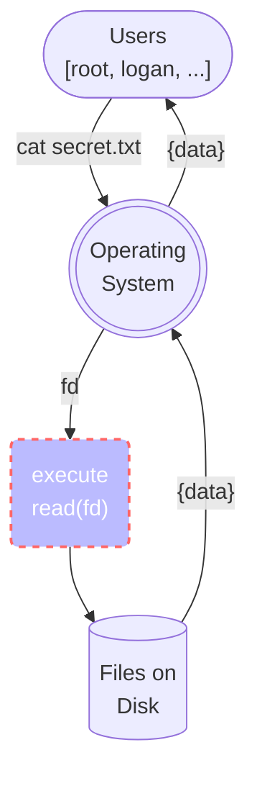

# Monitoring File Access with eBPF

```mermaid
flowchart TD
    users(["Users \n[root, logan, ...]"])
    os(((Operating\nSystem)))
    disk[(Files on \nDisk)]
    syscall("execute\nread(fd)")
    style syscall fill:#bbf,stroke:#f66,stroke-width:2px,color:#fff,stroke-dasharray: 5 5
    users -->|"cat secret.txt"| os
    os -->|"{data}"| users
    disk --> |"{data}"|os
    os --> |fd|syscall
    syscall --> disk
```