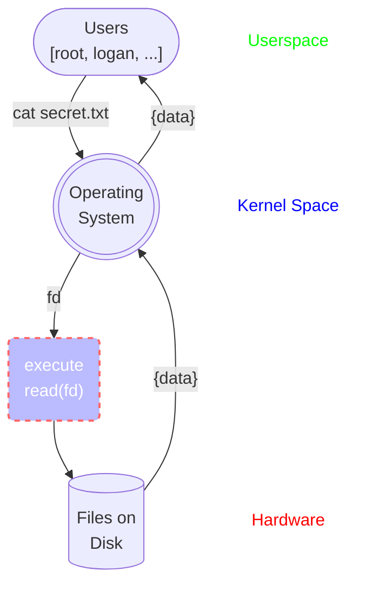
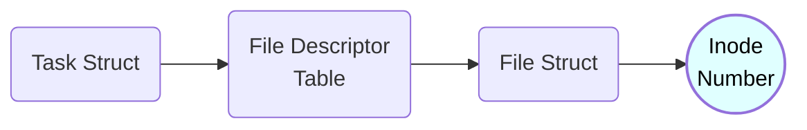

# Monitoring File Access with eBPF

## Visualizing File Reads

When reading a file on your computer, the following diagram is roughly what happens:

Obviously there are more steps than this such as first using the open system call to get a file descriptor, checking the cache for the file before checking disk, etc.

But for all practical purposes the above model will do. In writing the process is:

1) Some userspace process is executed by some user. This program asks the operating system to read a file based on its current file descriptors.
2) The operating system will execute the read() system call with the provided file descriptor e.g. read(fd).
3) The file data is returned by disk and passed all the way back up to the user.

Now how do we monitor every single time a file is read?

To do so we need to monitor every time the read() system call is executed and log this data. There are multiple approaches to doing this, I have chosen to do this using eBPF tracepoints. This was tested on Ubuntu 22.04 kernel version 5.19.

With the eBPF tracepoint in place the diagram becomes the following:

This is a bit simplified because really the tracepoint executes just before entering read() but the main point is it happens before retrieving the file from disk.

So what is the tracepoint doing? And how does this help us know when reads happen to a file? After all we know that file descriptors are only meaningful to the process they belong to. 

While that is true we need to remember how file descriptors get converted to files.

## Important Kernel Structures

The main kernel structures of importance are the following:

1) Task Struct
2) Files Decriptor Table
3) File Struct

Recall that on disk, every file has an unique inode. And unless some very specific scenarios happen this inode will be permanent to the file. Omitting just a few steps along the way, getting an inode looks roughly like the following:

Basically every process has a *task structure*. This task strcuture has access to the *file descriptor table* for that process. This table is **what gives file descriptors meaning** to the process. Every file descriptor is an index into this table that returns a specific *file struct* pertaining to a file opened by the process. The file struct ultimately holds the *inode* for the file.

Now what does this all have to do with our eBPF tracepoint?

## Bringing it all together

Recall that the read() system call, **as well as** the eBPF program execute in kernel space. One of the helper functions available to the eBPF program is [bpf_get_current_task()](https://github.com/iovisor/bcc/blob/master/docs/reference_guide.md#7-bpf_get_current_task). This function returns the task structure for the given process. 

